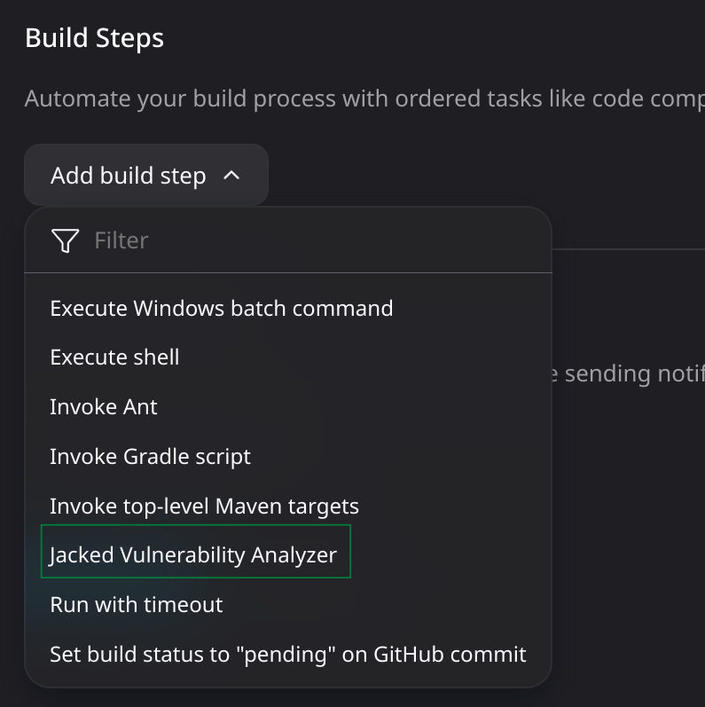
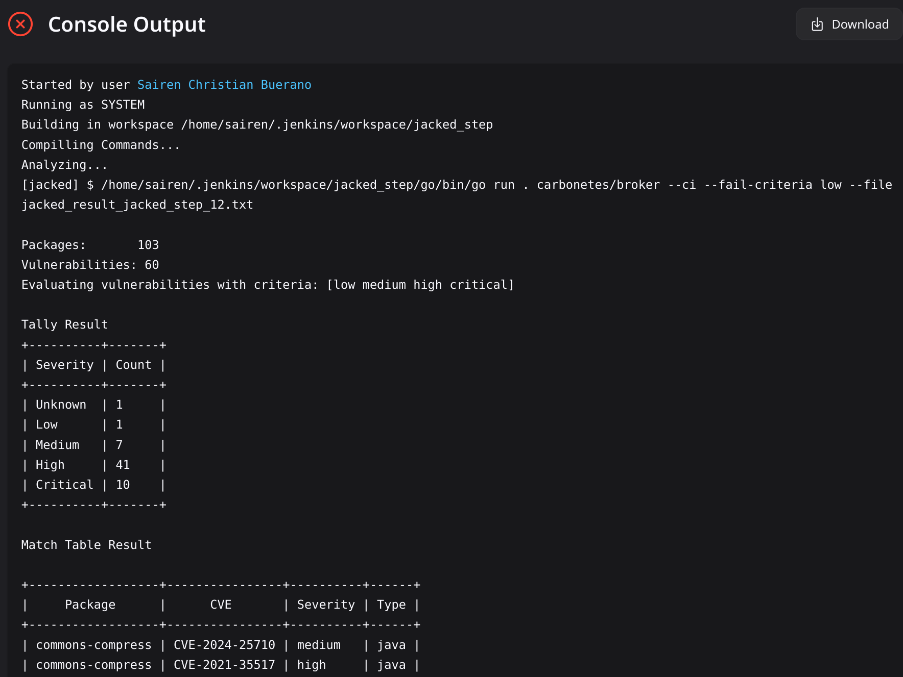

<p align="center">

</p>

[](https://github.com/carbonetes/jacked)
[](https://plugins.jenkins.io/jacked)
# Jenkins Plugin: Jacked

## Introduction
<br>

[Jacked](https://github.com/carbonetes/jacked) provides organizations with a comprehensive view of their applications to enable informed decision-making and improve security posture. Its primary purpose is to scan for vulnerabilities and guide mitigation efforts.

This Jenkins plugin scans a specified target and exposes its vulnerabilities.


## Getting started

This Jenkins plugin installs Jacked in the job’s workspace and runs a scan.
It automatically sets up all required dependencies to run Jacked.

# Usage as add build step


## Plugin Configuration


# Output



# Plugin Configuration Fields and Descriptions
## Scan Type
<b>Description: </b>Specified the input on scan field based on the selected scan type.
<br>
<b>Option:</b>
- `Image`: Provide the image:tag.
- `File System`: Provide the target filesystem directory path.
- `Tarball`: Provide the target tarball file path.
## Scan
<b>Input: </b> Image name, Directory path, or tar file path.
## Fail Criteria Severity
<b>Description: </b>Select a threshold that will fail the build when equal to or above the severity found in the results. 
<br>
<b>Option:</b> 
- Critical
- High
- Medium
- Low
- Negligible
- Unknown

## Skip Build Fail
Default value is `false / unchecked`.
<br>
<b>Warning:</b> If the value is checked, it will restrict the plugin from failing the build based on the analysis result.

# Usage as Pipeline
```yaml
pipeline {
    agent any
    stages {
        stage('Jacked Scan') {
            steps {
                script {
                    jacked(
                        scanType: 'image',           // Choose Scan Type: image, filesystem, or tarball.
                        scanName: 'ubuntu',          // Input: image:tag, filesystem dir path, or tarball file path.
                        severityType: 'high',        // Choose Fail Criteria Severity as a threshold.
                        skipFail: false,             // Default as false. Always Build Success [Not recommended to set true!]
                    )
                }
            }
        }
    }
}
```
# LICENSE

Licensed under MIT, see [LICENSE](LICENSE.md)

