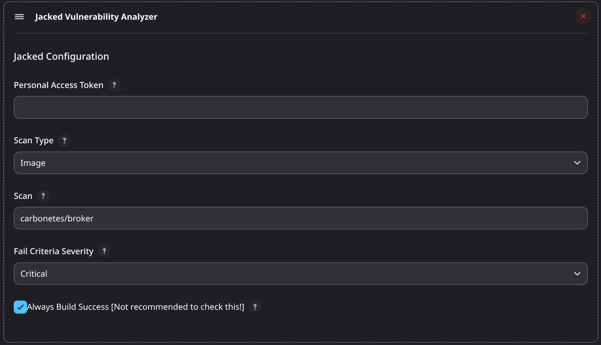
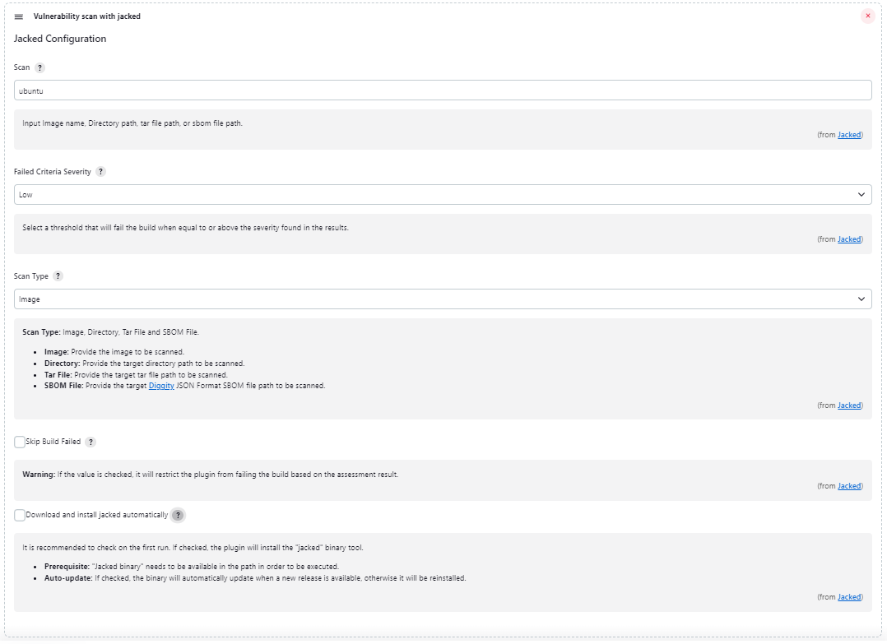

# jenkins-jacked

## Introduction

[Jacked](https://github.com/carbonetes/jacked) Jacked provides organizations with a more comprehensive look at their application to take calculated actions and create a better security approach. Its primary purpose is to scan vulnerabilities to implement subsequent risk mitigation measures.

This jenkins plugin scans a given target and expose vulnerability.

## Getting started

This jenkins plugin installs jacked in the job workspace directory and performs scan. 
See section [Installation/Recommended](https://github.com/carbonetes/jacked) for more installation details.

### Usage as add build step



### Plugin Configuration




### Usage as Pipeline
```sh
pipeline {
    agent any
    
    stages {
        stage('Vulnerability Scan') {
            steps {
                  jacked scanDest: scanName: 'alpine', severityType: 'high', autoInstall: true  
            }
        }
    }
}

```

## LICENSE

Licensed under MIT, see [LICENSE](LICENSE.md)

