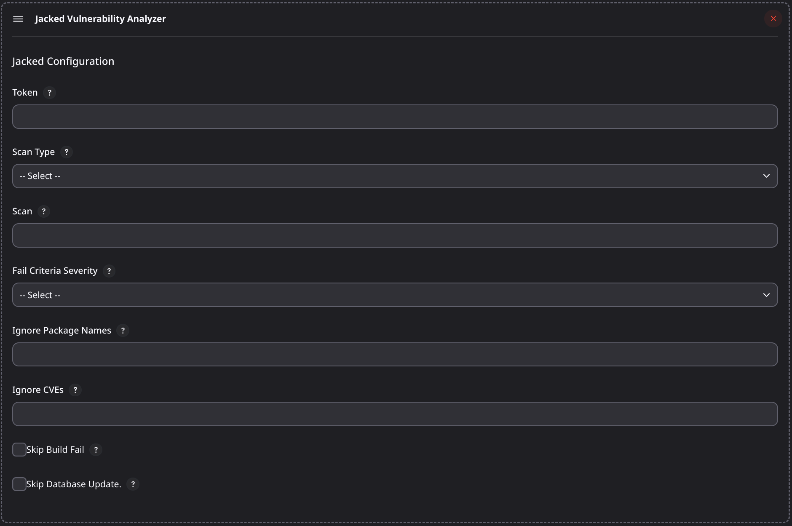

# jenkins-jacked

## Introduction

[Jacked](https://github.com/carbonetes/jacked) Jacked provides organizations with a more comprehensive look at their application to take calculated actions and create a better security approach. Its primary purpose is to scan vulnerabilities to implement subsequent risk mitigation measures.

This jenkins plugin scans a given target and expose vulnerability.

## Getting started

This jenkins plugin installs jacked in the job workspace directory and performs scan. 
See section [Installation/Recommended](https://github.com/carbonetes/jacked) for more installation details.

### Usage as add build step


### Plugin Configuration




### Usage as Pipeline
```sh
pipeline  
{  
    agent any  
    options {  
        skipStagesAfterUnstable()  
    }  
    stages {  
        stage('Build') {  
            steps {  
                step([$class: 'jacked', scanName: 'alpine', selectedSeverityLevel: 'medium', autoInstall: true]) 
            }  
        }  
    }  
} 
```

## Issues

TODO Decide where you're going to host your issues, the default is Jenkins JIRA, but you can also enable GitHub issues,
If you use GitHub issues there's no need for this section; else add the following line:

Report issues and enhancements in the [Jenkins issue tracker](https://issues.jenkins-ci.org/).

## Contributing

TODO review the default [CONTRIBUTING](https://github.com/jenkinsci/.github/blob/master/CONTRIBUTING.md) file and make sure it is appropriate for your plugin, if not then add your own one adapted from the base file

Refer to our [contribution guidelines](https://github.com/jenkinsci/.github/blob/master/CONTRIBUTING.md)

## LICENSE

Licensed under MIT, see [LICENSE](LICENSE.md)

