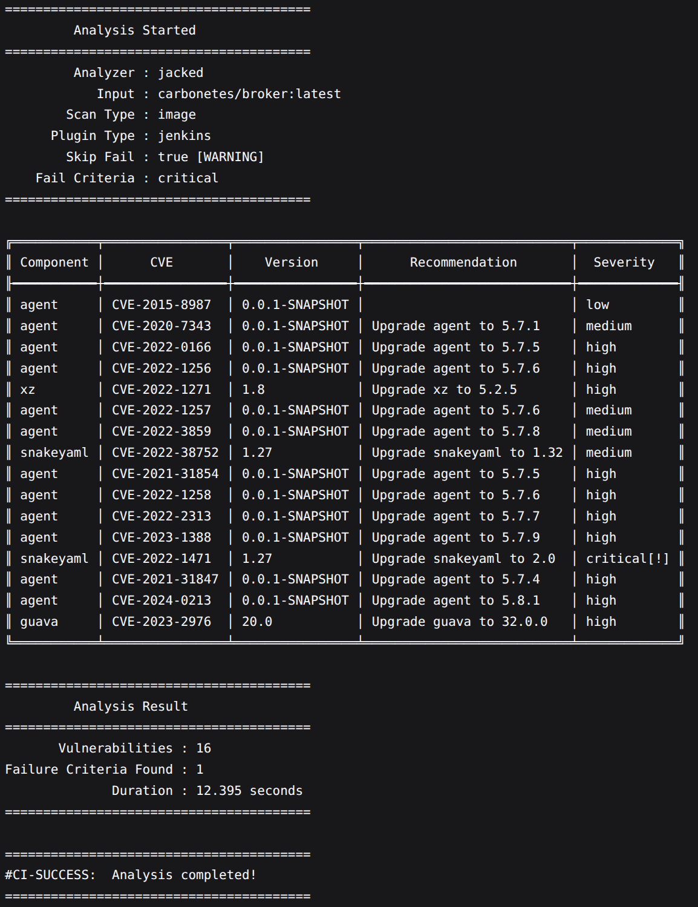

<p align="center">

</p>

[](https://github.com/carbonetes/jacked)
[](https://plugins.jenkins.io/jacked)
# Jenkins Plugin: Jacked

## Introduction
<br>

[Jacked](https://github.com/carbonetes/jacked) provides organizations with a comprehensive view of their applications to enable informed decision-making and improve security posture. Its primary purpose is to scan for vulnerabilities and guide mitigation efforts.

This Jenkins plugin scans a specified target and exposes its vulnerabilities.


## Getting started

This Jenkins plugin installs Jacked in the job’s workspace and runs a scan.
It automatically sets up all required dependencies to run Jacked.

# Usage as add build step


## Plugin Configuration


# Output


Provides the following:
- Show a list of packages.
- `Analyzing BOM`: Showing vulnerabilities found and providing recommendations to fix them.
- Assessment Result: Pass or Fail based on the selected fail criteria severity type.
- Saves output file on the workspace in every build. `jacked_result_$(JOBNAME)_$(BUILDNUMBER).txt`
- Saves Stored Values JSON File for Environment Variables. `jackedTmpDir/jacked_file.json`

# Plugin Configuration Fields and Descriptions
## Scan Type
<b>Description: </b>Specified the input on scan field based on the selected scan type.
<br>
<b>Option:</b>
- `Image`: Provide the image to be scanned.
- `Directory`: Provide the target directory path to be scanned.
- `Tar File`: Provide the target tar file path to be scanned.
- `SBOM File`: Provide the target [Diggity](https://github.com/carbonetes/diggity) JSON Format SBOM file path to be scanned.
## Scan
<b>Input: </b> Image name, Directory path, tar file path, or sbom file path.
## Fail Criteria Severity
<b>Description: </b>Select a threshold that will fail the build when equal to or above the severity found in the results. 
<br>
<b>Option:</b> 
- Critical
- High
- Medium
- Low
- Negligible
- Unknown

## Skip Build Fail
Default value is `false / unchecked`.
<br>
<b>Warning:</b> If the value is checked, it will restrict the plugin from failing the build based on the assessment result.

## Skip Database Update
Default value is `false / unchecked`.
<br>
<b>Warning:</b> If the value is checked, it will skip check database update while scanning.

# Usage as Pipeline
```yaml
pipeline {
    agent any
    stages {
        stage('Jacked Scan') {
            steps {
                script {
                    jacked(
                        scanType: 'image',           // Choose Scan Type: image, directory, tar, or sbom.
                        scanName: 'ubuntu',          // Input: Image name, Directory path, tar file path, or sbom file path.
                        severityType: 'high',        // Threshold to fail the build.
                        skipFail: false,             // Default as false.
                        skipDbUpdate: false          // Default as false.
                    )
                }
            }
        }
    }
}
```
## Pipeline Usage Guide: Accessing Stored Values for Your Environment Variable Usage.
Welcome to this guide on accessing stored values for your environment variable usage. In this document, we will explore how you can retrieve and utilize stored values effectively in your environment variables within your applications or scripts.

### Why Environment Variables?
Environment variables provide a flexible way to store and manage configuration values that are essential for your applications or scripts. They allow you to separate configuration from code, making it easier to deploy and maintain your software across different environments.

### Storing Values in Jenkins
[Jenkins](https://www.jenkins.io) is a popular open-source automation server that enables continuous integration and delivery (CI/CD) workflows. It offers various features, including the ability to store and manage environment variables.

### Retrieving Stored Values in Jenkins
One common use case is retrieving stored values from Jenkins and utilizing them as environment variables within your pipeline scripts. Jenkins provides convenient methods to access and utilize these values during the build process.

### Example: Reading JSON Files
We'll walk you through an example of reading values from a JSON file stored in Jenkins and using them as environment variables. This can be particularly useful for storing and accessing configuration settings or external dependencies.

### Conclusion
Understanding how to access stored values for your environment variable usage is crucial for building robust and configurable applications or scripts. By leveraging tools like Jenkins and following best practices, you can streamline your development process and ensure smooth deployments across different environments.

Now, let's dive into the details and learn how to effectively access stored values in your environment variables!

## Pipeline Usage Guide: Adding catchError() Block.
```yaml
catchError(buildResult: 'SUCCESS', stageResult: 'FAILURE') { // Jacked Scan script.. }
```
In this script, we have added a catchError() block to ensure that all stages within the pipeline are executed, regardless of failures. By default, when a specific stage fails, the pipeline skips all subsequent stages. However, with the catchError() block in place, this behavior is overridden.
<br><br>
Since we are utilizing a vulnerability scanner, it is expected that the build may fail based on the assessment results. This is important to inform users that vulnerabilities have been detected and need to be addressed.

### Here's what it looks like when the catchError block added on our pipeline script:
```yaml
stage('Jacked Scan') {
    steps {
        catchError(buildResult: 'SUCCESS', stageResult: 'FAILURE') { // Prevents other stages to be skipped when JACKED ASSESSMENT is failed
            script {
                jacked scanType: 'images',          // Choose Scan Type: image, directory, tar, or sbom.
                scanName: 'alpine',                 // Input: Image name, Directory path, tar file path, or sbom file path.
                severityType: 'high',               // Select a threshold that will fail the build when equal to or above the severity found in the results. 
                                                    // Severity: critical, high, medium, low, negligible, unknown.
                skipFail: false,                    // Default as false. Skip build to fail based on the assessment.
                skipDbUpdate: false,                // Default as false. Skip Database Update when scanning.
            }
        }
    }
}
```
Once implemented we are now ready to add more stages based on your usage to our pipeline script.
<br>
## Pipeline Usage Guide: Adding Read JSON File Stage to Access Stored Values for Environment Variable Usage.
### `NOTE: Prerequisite Plugin:` Pipeline Utility Steps 2.15.4 or higher to access `readJSON`
In this pipeline script, we have included a stage called "Read JSON" to facilitate the extraction of stored values from a JSON file and utilize them as environment variables. This stage allows you to access multiple values from the JSON file and incorporate them into your pipeline's environment.
<br><br>
By using the readJSON step, we can retrieve various values from the JSON file and assign them to variables. In addition to the "buildStatus" value, we can also extract other key-value pairs such as "jackedAssessment,", "assessmentSummary" "scanType," and "scanName" from the JSON file.
```yaml
    def jackedFilePath = "${env.WORKSPACE}/jackedTmpDir/jacked_file.json"
    def json = readJSON file: jackedFilePath
    def jackedAssessment = json.jackedAssessment
    def assessmentSummary = json.assessmentSummary
    def scanType = json.scanType
    def scanName = json.scanName
    def buildStatus = json.buildStatus

    // Optional: Display Value, File Path
    echo "Build Status: ${buildStatus}"
    echo "File path: ${jackedFilePath}"

    // Set the value as a global environment variable
    env.BUILD_STATUS = buildStatus
    env.jackedAssessment = jackedAssessment
    env.assessmentSummary = assessmentSummary
    env.scanType = scanType
    env.scanName = scanName
```

Once the values are extracted, we can echo them to provide visibility and confirmation of the retrieved data. Furthermore, these values can be set as global environment variables, allowing you to utilize them across different stages or post-processing actions within your pipeline.
```yaml
    // Set the value as a global environment variable
    env.BUILD_STATUS = buildStatus
    env.jackedAssessment = jackedAssessment
    env.assessmentSummary = assessmentSummary
    env.scanType = scanType
    env.scanName = scanName

    // Optional: Display Value
    echo "Build Status: ${buildStatus}"

    // Display File Path
    def jackedFilePath = "${env.WORKSPACE}/jackedTmpDir/jacked_file.json"
    echo "File path: ${jackedFilePath}"
```
### Accessing JSON Stored Key-value Pairs for Environment Variables.
```yaml
stage('Read JSON') {
    steps {
        script {
            def jackedFilePath = "${env.WORKSPACE}/jackedTmpDir/jacked_file.json"
            def json = readJSON file: jackedFilePath
            def jackedAssessment = json.jackedAssessment
            def assessmentSummary = json.assessmentSummary
            def scanType = json.scanType
            def scanName = json.scanName
            def buildStatus = json.buildStatus

            // Optional: Display Value, File Path
            echo "Build Status: ${buildStatus}"
            echo "File path: ${jackedFilePath}"

            // Set the value as a global environment variable
            env.BUILD_STATUS = buildStatus
            env.jackedAssessment = jackedAssessment
            env.assessmentSummary = assessmentSummary
            env.scanType = scanType
            env.scanName = scanName
        }
    }
}
```
<br><br>
With the flexibility provided by the "Read JSON" stage, you can effortlessly access and utilize multiple stored values from a JSON file, empowering you to customize your pipeline's behavior based on the extracted information.

## Here's the overall script guide from Jacked Scan Stage and Read JSON for Environment Variables.
```yaml
pipeline {
    agent any
    stages {
        stage('Jacked Scan') {
            steps {
                catchError(buildResult: 'SUCCESS', stageResult: 'FAILURE') {
                    script {
                        jacked scanType: 'image',       // Choose Scan Type: image, directory, tar, or sbom.
                        scanName: 'alpine',             // Input: Image name, Directory path, tar file path, or sbom file path.
                        severityType: 'high',           // Select a threshold that will fail the build when equal to or above the severity found in the results. 
                                                        // Severity: critical, high, medium, low, negligible, unknown.
                        skipFail: false,                // Default as false. Skip build to fail based on the assessment.
                        skipDbUpdate: false,            // Default as false. Skip Database Update when scanning.
                        
                    }
                }
            }
        }
        stage('Read JSON') {
            steps {
                catchError(buildResult: 'SUCCESS', stageResult: 'FAILURE') {
                    script {
                        def jackedFilePath = "${env.WORKSPACE}/jackedTmpDir/jacked_file.json"
                        def json = readJSON file: jackedFilePath
                        def jackedAssessment = json.jackedAssessment
                        def assessmentSummary = json.assessmentSummary
                        def scanType = json.scanType
                        def scanName = json.scanName
                        def buildStatus = json.buildStatus

                        // Optional: Display Value, File Path
                        echo "Build Status: ${buildStatus}"
                        echo "File path: ${jackedFilePath}"

                        // Set the value as a global environment variable
                        env.BUILD_STATUS = buildStatus
                        env.jackedAssessment = jackedAssessment
                        env.assessmentSummary = assessmentSummary
                        env.scanType = scanType
                        env.scanName = scanName
                    }
                }
            }
        }
    }
    post {
        always {
            // Access the global environment variable
            echo "jackedAssessment: ${env.jackedAssessment}"
            echo "assessmentSummary: ${env.assessmentSummary}"
            echo "scanType: ${env.scanType}"
            echo "scanName: ${env.scanName}"
            echo "Build Status: ${env.BUILD_STATUS}"
        }
    }
}
```
### Here's a sample of the stored values inside a JSON file named `jacked_file.json` that is generated inside workspace directory name: `jackedTmpDir`.
```yaml
{
    "scanName":"ubuntu",
    "jackedAssessment":"failed",
    "assessmentSummary":"Failed:     6 out of 10 found vulnerabilities failed the assessment",
    "scanType":"image",
    "buildStatus":"failed"
}
```
# LICENSE

Licensed under MIT, see [LICENSE](LICENSE.md)

